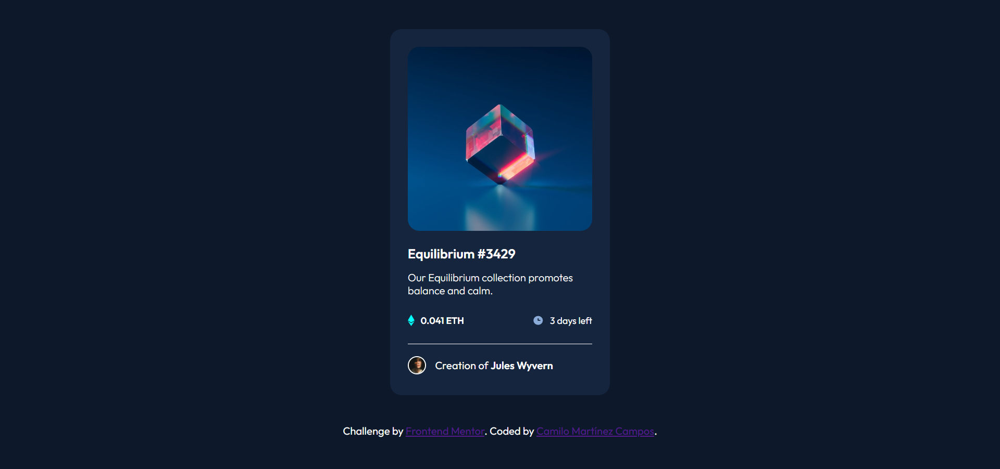

# Frontend Mentor - NFT preview card component solution

This is my solution to the [NFT preview card component challenge on Frontend Mentor](https://www.frontendmentor.io/challenges/nft-preview-card-component-SbdUL_w0U).

## Table of contents

- [Overview](#overview)
  - [The challenge](#the-challenge)
  - [Screenshot](#screenshot)
  - [Links](#links)
- [My process](#my-process)
  - [Built with](#built-with)
  - [What I learned](#what-i-learned)
  - [Useful resources](#useful-resources)
- [Author](#author)

## Overview

### The challenge

Users should be able to:

- View the optimal layout depending on their device's screen size
- See hover states for interactive elements

### Screenshot



### Links

- Solution URL: [solution](https://github.com/camilomcm/NFT)
- Live Site URL: [live site](https://camilomcm.github.io/NFT/)

## My process

### Built with

- HTML
- CSS
- Flexbox
- Font Awesome

### What I learned

In this project I was able to continue practicing my HTML and CSS skills. Something new that I learned was do hover over an image while darken this one and make an element appear as follows:

```html
<div class="overlay">
  
  <div id="content"></div>
  <i class="fa-solid fa-eye"></i>
</div>
```
```css
.fa-solid {
  visibility: hidden;
  font-size: 2.5rem;
  position: absolute;
  top: 50%;
  left: 50%;
  margin: -20px 0 0 -20px;
}

#content:hover {
  background-color: hsl(178, 100%, 50%);
  opacity: 0.5;
  cursor: grab;
}

#content:hover + .fa-solid {
  visibility: visible;
}
```

### Useful resources

- [Hover over image](https://www.w3schools.com/howto/howto_css_image_overlay.asp) - This helped me to understand how to make hover over the image.

## Author

- Frontend Mentor - [@camilomcm](https://www.frontendmentor.io/profile/camilomcm)